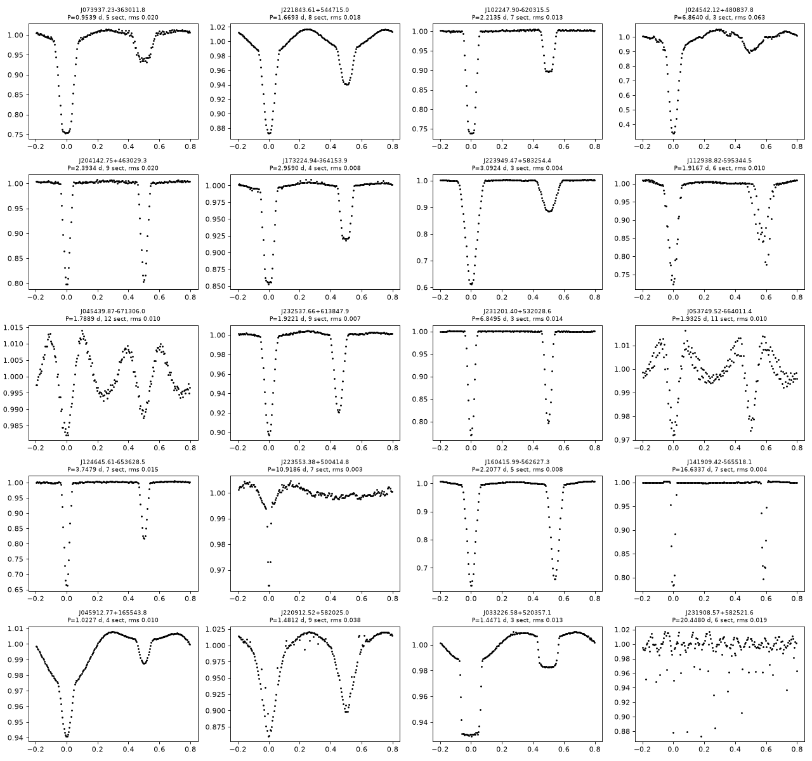
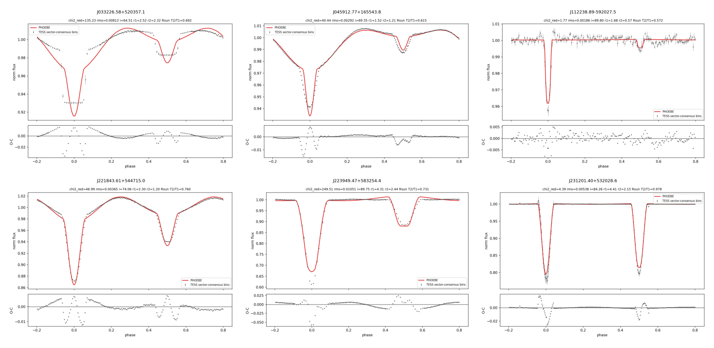
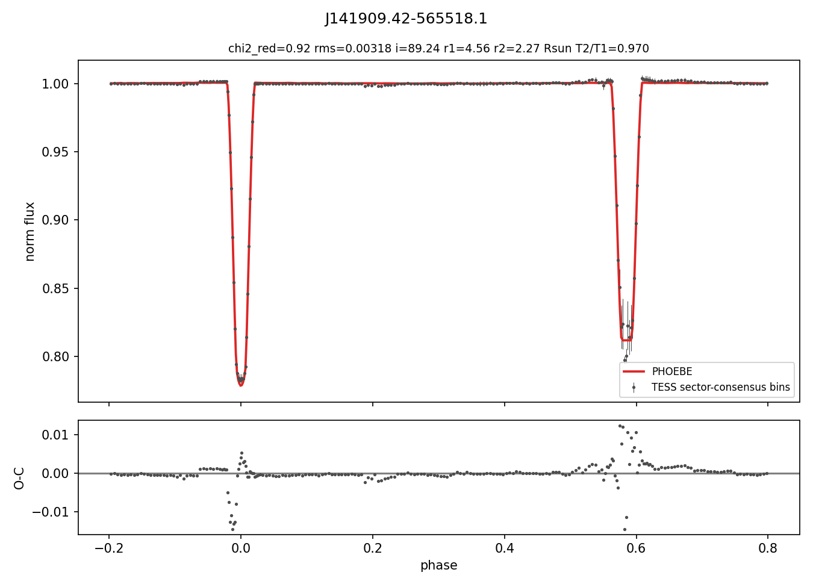

# Disk Detective × Eclipsing-Binary Cross-Match

Date: 2026-10-02
Scripts: `src/crossmatch/` (catalogue build, cross-match, sanity checks, tables) and `src/pipeline/` (TESS light curves, PHOEBE)

## Goal

Find the next DD objects to model after J0719 and J1122: Disk Detective targets that are also catalogued eclipsing binaries, that hold up under SED, photometry and confusion checks, and that have usable TESS data for the PHOEBE pipeline.

## Inputs

| List | Source | Rows |
|---|---|---:|
| DD1.0 | `WZ_subjects_*.txt` (35 IPAC tables, AllWISE + 2MASS; from `~/Downloads/WZSubs.zip`, duplicate `-5to-4 copy` file skipped) | 412,729 unique |
| DD2.x | `data/catalogs/DDv2.1_Wise_Ids.txt` (AllWISE designations; positions parsed from the name) | 1,419 unique |
| Previous EB list | `data/catalogs/EB_WiseID_previous.txt` (`EB_WiseID.txt.lf`) | 7,827, of which only 6 are DD1 objects (J0719, J1122, J0136+62, J2039+46, J2052+44, J2219+61) |

The WZSubs folder is not committed (86 MB). Unzip `WZSubs.zip` into `data/catalogs/` to rebuild it.

## EB surveys cross-matched (3″ radius)

Fourteen VizieR EB/variable catalogues went through the CDS XMatch service. ASAS-SN is not served by XMatch, so its EA/EB/EW classes (154,530 stars) were downloaded and matched locally.

| Survey | VizieR | Eclipsing selection | DD1 matches | DD2 matches |
|---|---|---|---:|---:|
| Gaia DR3 variability classifier † | I/358/vclassre | Class = ECL | 407 | 0 |
| VSX | B/vsx/vsx | type token E/EA/EB/EW/ED/EC/ESD/E-DO (EP planets excluded) | 566 | 2 |
| ZTF periodic variables (Chen+2020) | J/ApJS/249/18 | EA, EW | 108 | 0 |
| ATLAS variables (Heinze+2018) | J/AJ/156/241 | CBF, CBH, DBF, DBH | 76 | 1 |
| ASAS-SN variables | II/366 | EA, EB, EW | 58 | 1 |
| ASAS-3 | II/264/asas3 | EC, ED, ESD | 33 | 0 |
| OGLE LMC EBs | J/AcA/66/421 | C, NC | 31 | 0 |
| TESS OBA-type EBs (IJspeert+2021) | J/A+A/652/A120 | all | 26 | 0 |
| TESS EB catalogue (Prša+2022) | J/ApJS/258/16 | all | 24 | 5 |
| WISE variables (Chen+2018) | J/ApJS/237/28 | EA, EW | 22 | 0 |
| CRTS North / South | J/ApJS/213/9, J/MNRAS/469/3688 | Cl 1–3 | 7 / 4 | 1 / 0 |
| NSVS (Hoffman+2009) | J/AJ/138/466 | Vcl A/W/B | 3 | 0 |
| OGLE-IV EB parameters (Wang+2024) | J/ApJS/275/12 | all | 3 | 0 |
| Kepler EBs | J/AJ/151/68 | all | 2 | 0 |
| DEBCat | V/152 | all | 1 (CW Cep) | 0 |
| **Unique DD objects** | | | **800** | **9** |

† The Gaia entry is the general machine-learning variability classifier (`vari_classifier_result`), not the dedicated EB pipeline (`vari_eclipsing_binary`, I/358/veb), because `veb` has no coordinates for XMatch. **Follow-up check** (`src/crossmatch/gaia_veb_join.py`, Gaia archive TAP join → `outputs/crossmatch/dd1_gaia_veb.csv`):
- all 408 Gaia `ECL` matches have a `vari_eclipsing_binary` solution;
- 358 of them also have a period from another survey, and for **342 of those (96%) the Gaia period agrees** within 1%, allowing ×2 and ×½ aliases.
- **Correction (2026-10-06):** that 96% is partly circular, because 274 VSX entries are Gaia DR3 re-ingests and carry the Gaia period. Against periods from surveys that are not Gaia-derived (102 objects), the Gaia period agrees for **90 (88%)**. See "Reliability of the Gaia and VSX EB labels" below.

The 16 disagreements are mostly Gaia period aliases. Tier-A examples:

| Object | Gaia period | Other surveys and TESS |
|---|---:|---:|
| J173224.94−364153.9 | 2.722 d | 2.959 d |
| J024542.12+480837.8 | 12.66 d | 6.864 d |

The Gaia `ECL` class is a reliable EB indicator for this sample. Its periods should be checked against TESS rather than adopted directly.

None of the 800 DD1 matches were in the old `EB_WiseID` list apart from J0719 (VSX type `ED`). That list came from a different source, so this search is almost entirely new ground.

VSX re-ingests Gaia, ASAS-SN, ZTF, ATLAS and TESS classifications. Independent confirmation is therefore counted after mapping each VSX entry back to its parent survey (`n_independent`).

## Sanity checks

`src/crossmatch/sanity_checks.py` queries AllWISE (qph/ccf/ex flags), Gaia DR3 (12″ cone), TIC v8.2 and SIMBAD for every match, then applies:

| Check | Rule | DD1 pass rate |
|---|---|---:|
| match | nearest separation ≤ 1.5″ or ≥ 2 independent surveys | 82% |
| multi_survey | ≥ 2 independent EB surveys | 18% |
| period | survey periods agree within 1% (allowing ×2 / ×½ aliases) | 99% |
| period_plausible | 0.15–30 d; contact classes (EW/EC/CBF/CBH) < 1.5 d | 78% |
| wise_quality | W3 and W4 `qph` A/B, `ccf` 0 or d, `ex` = 0 | 74% |
| **ir_excess (blackbody check)** | W3 or W4 ≥ 5σ above **both** a free blackbody fitted to J,H,Ks,W1 **and** a blackbody fixed at the TIC Teff; the excess band must have qph A/B (not an upper limit) | 83% |
| **photosphere (photometry check)** | catalogue-Teff blackbody fits J,H,Ks,W1 with χ² < 60 (no strong near-IR/hot-dust excess) | 27% |
| dust_over_ff | single-temperature dust blackbody fits W2–W4 excess better than free-free (α = −0.1…0.6) | 79% |
| unconfused | no Gaia source within 6″ brighter than G+2.5; neighbours within 12″ < 25% of target G flux | 67% |
| tess_usable | TIC contamination ratio < 0.3 and Tmag < 14.5 | 67% |
| not_evolved_or_wind | SIMBAD type not LPV/Mira/AGB/RSG/WR/Be/emission-line/PN/symbiotic/supergiant | 67% |
| nearby | Gaia distance < 3 kpc (GSP-Phot, else 1/parallax if S/N > 5) | — |

Tiers:
- **A**: every critical check passes, plus photosphere, dust_over_ff, ≥ 2 independent surveys, nearby, and not a SIMBAD YSO.
- **B**: every critical check passes, but the object is single-survey, a YSO, fails the photosphere check, or is distant.
- **C**: fails a critical check (match, period plausibility, WISE quality, IR excess, confusion, TESS usability, evolved/wind type).

Result: **DD1 12 A / 119 B / 669 C; DD2 0 / 0 / 9.**

### Disk Detective 1.0 excess methodology vs ours (added 2026-10-06)

Sources: Kuchner et al. 2016 (ApJ 830, 84; arXiv:1607.05713) and Silverberg et al. 2018 (ApJ 868, 43; arXiv:1809.09663), read through ar5iv. Thresholds are quoted from the text. Table-level details were not checked.

**DD1.0 selection (a W1−W4 colour cut, not an SED fit):**
- [W1]−[W4] > 0.25 mag, a ≥26% excess over a Rayleigh–Jeans slope from W1 to W4 (`w4mpro < w1mpro − 0.25`);
- [W1]−[W4] > 5σ of the colour error;
- W4 S/N ≥ 10 (`w4snr`), and W4 profile-fit `w4rchi2 < 1.3`;
- no AllWISE contamination flags (`cc_flags`, `ext_flg`, `xscprox`, `na`/`nb`, `n_2mass` cuts);
- for M stars, [W1]−[W4] > 0.9;
- W4 is the primary band. W3 plays no role in selection, and the papers do not fit SEDs, dust temperatures or L_IR/L★ for the candidate lists.

**DD1.0 vetting (the "quality labels"):**
- Volunteers classify image flipbooks (DSS, 2MASS, WISE; 10.5″ circle) into six labels: *Multiple objects in the red circle*, *Object moves off the crosshairs*, *Extended beyond circle in WISE images*, *Empty circle in WISE images*, *Not round in DSS2 or 2MASS*, and *None of the above / good candidate*.
- A subject is "good" when the majority choose *good candidate*. About 90% of subjects are rejected at this stage.
- Advanced users then check the literature (SIMBAD/VizieR) to remove M giants, classical Be stars and AGN (14% of good subjects), needing at least two opinions per object.
- High-resolution imaging (Robo-AO, RetroCam) finds background contaminants in 7% ± 1% of followed-up targets. For each contaminant, the W4 contribution (M-dwarf or flat-spectrum SED) is subtracted and [W1]−[W4] recomputed to see whether the excess survives.

**How ours differs:**
- **Excess significance.** We fit SEDs (blackbody photospheres, then the PHOEBE two-star photosphere) and require ≥5σ in W3 or W4. DD1.0 uses a model-free W1−W4 colour cut, so a W4-only DD object can pass theirs and still fail ours if the photosphere explains it.
- **W3.** We accept W3-only excess. DD1.0 does not select on W3 at all.
- **Contamination.** Our WISE image check plus Gaia crowding stands in for their volunteer labels and high-resolution imaging. Their labels are independent visual vetting we do not yet use.

**To do** (in "Daily next steps"): add `dd_w1w4`, `dd_w1w4_sigma`, `dd_w4snr`, `dd_w4rchi2` and `dd_flags_ok` columns to the scored tables, plus the DD1.0 volunteer quality labels, and report where our tiers disagree with DD1.0's selection. This needs AllWISE `w1mpro`, `w4mpro`, their errors, `w4snr`, `w4rchi2`, `cc_flags` and `ext_flg`, which are in the WZ_subjects tables or the AllWISE cache. Neither is in the repo yet.

### WISE image check

Catalogue W3/W4 photometry can have clean flags (qph A, ccf 0) and still be dominated by extended nebulosity. `src/crossmatch/wise_cutouts.py` pulls 2′×2′ AllWISE W1–W4 cutouts from SkyView for every tier-A/B object (images in `outputs/crossmatch/wise_cutouts/`). It then measures whether a compact W3 or W4 source (S/N ≥ 5) sits within 4″ of the star. A failure blocks tier A but only demotes the object to B for visual review, because the S/N estimate can be fooled by bright nebular gradients. J0719 itself fails the automated check, yet its images show a compact, centred W3/W4 source.

Confirmed by eye as nebular contamination (no compact W3/W4 source at the star): **J102247.90−620315.5, J204142.75+463029.3, J124645.61−653628.5**. All three were tier A before the image check.

### DD2 result

All nine DD2 matches are nearby M dwarfs (high proper motion). Their W4 "excess" comes from W4 upper limits (`qph` = `AAAU`), so none survive the quality check. DD2 yields no usable EB candidate from these surveys. J0136, J0333, J2039, J2052 and J2219, the earlier DD2-named targets, are not catalogued EBs in any of these surveys.

### Example of the checks working

- **CW Cep** (DEBCat, B0.5V+B0.5V, P = 2.73 d) has strong W3/W4 excess, but free-free fits it better than dust (χ² 0.8 vs 16.8) and SIMBAD lists it as Be*. It is correctly sent to tier C as a wind/free-free source, not a debris disk.
- Tier A initially included two LMC systems (J0454−67 and J0537−66, ~14 kpc, W4 300–700× photosphere). At that distance the 12″ W4 beam covers almost a parsec, so the `nearby` check now removes them.

## Tier-A candidates

`*` marks objects with no TIC Teff, where the excess is measured against the free-temperature blackbody only.

| DD1 designation     | EB surveys (indep.)                                    |   P (d) | TIC Teff   | W3σ / W4σ    | W4 obs/phot   | T_dust (K)   |   Tmag | d (pc)   |   RUWE |   TESS sect. | SIMBAD   | failed checks   |
|:--------------------|:-------------------------------------------------------|--------:|:-----------|:-------------|:--------------|:-------------|-------:|:---------|-------:|-------------:|:---------|:----------------|
| J073937.23-363011.8 | gaia_dr3;tess_oba_ebs;vsx;wise_chen2018 (4)            |  0.9551 | –          | 2.6* / 17.5* | 5.6*          | 125*         |    8.2 | 396      |   1.07 |            5 | EclBin   |                 |
| J221843.61+544715.0 | asassn;atlas_heinze2018;gaia_dr3;vsx;wise_chen2018 (4) |  1.6692 | 6911       | 18.4 / 13.7  | 26.2          | 162          |   11.5 | 1268     |   0.96 |            8 | SB*      |                 |
| J024542.12+480837.8 | gaia_dr3;vsx;wise_chen2018 (3)                         |  6.8639 | 8664       | 0.5 / 10.7   | 2.8           | 109          |    8.3 | 907      |   0.89 |            3 | SB*      |                 |
| J173224.94-364153.9 | gaia_dr3;tess_oba_ebs;vsx (3)                          |  2.959  | –          | -0.4* / 6.6* | 2.6*          | 40*          |    8.4 | 804      |   1.01 |            4 | EclBin   |                 |
| J223949.47+583254.4 | gaia_dr3;vsx;wise_chen2018 (3)                         |  3.0922 | 8188       | 0.1 / 5.8    | 2.1           | 84           |    8.9 | 989      |   1.17 |            4 | EclBin   |                 |
| J231201.40+532028.6 | gaia_dr3;vsx (2)                                       |  6.8495 | 8547       | 5.1 / 12.3   | 3.3           | 179          |    8.6 | 742      |   0.89 |            5 | EclBin   |                 |
| J223553.38+500414.8 | tess_ebs;tess_oba_ebs (2)                              | 10.9206 | 12746      | -0.5 / 8.4   | 1.6           | 40           |    6.3 | 566      |   1.05 |            7 | SB*      |                 |
| J160415.99-562627.3 | gaia_dr3;vsx (2)                                       |  2.2078 | 10970      | 1.1 / 8.7    | 3.7           | 117          |    8.9 | 950      |   0.73 |            6 | EclBin   |                 |
| J141909.42-565518.1 | tess_oba_ebs;vsx (2)                                   | 16.6336 | –          | -0.0* / 8.5* | 2.9*          | 40*          |    8.4 | 788      |   0.86 |            7 | EclBin   |                 |
| J045912.77+165543.8 | gaia_dr3;vsx (2)                                       |  1.0227 | 8714       | 2.1 / 8.4    | 2.9           | 144          |    8.7 | 458      |   1.31 |            4 | EclBin   |                 |
| J220912.52+582025.0 | atlas_heinze2018;vsx;ztf_chen2020 (2)                  |  1.4813 | –          | 8.0* / 7.5*  | 2.8*          | 234*         |   12.1 | –        |  42.76 |            9 | EclBin   |                 |
| J033226.58+520357.1 | gaia_dr3;vsx (2)                                       |  1.4471 | 10465      | 1.9 / 7.3    | 2.5           | 150          |    8.3 | 683      |   2.08 |            4 | EclBin   |                 |

Notes:
- **J221843.61+544715.0** is the cleanest debris-like SED. It is photospheric through W2, then has a 162 K excess at 18σ (W3) and 14σ (W4), with f_IR ≈ 4×10⁻³. It has 4 independent EB detections and 8 TESS sectors.
- J220912.52+582025.0 has Gaia RUWE = 42.8, which suggests an unresolved visual companion. Treat its W3/W4 excess with caution.
- J073937, J173224 and J141909 have no TIC Teff (hot OB stars). Their excess relies on the free blackbody, and dust vs free-free should be re-checked with a hot-star atmosphere.
- W4-only excesses of 2–3× (J0245, J2239, J0459, J0332, J1604, J1419, J2235) are statistically significant but weaker. Inspect the unWISE W4 images before claiming dust.

## Tier-B (top 40 by score)

| DD1 designation     | EB surveys (indep.)                                |    P (d) | TIC Teff   | W3σ / W4σ     | W4 obs/phot   | T_dust (K)   |   Tmag | d (pc)   |   RUWE |   TESS sect. | SIMBAD    | failed checks           |
|:--------------------|:---------------------------------------------------|---------:|:-----------|:--------------|:--------------|:-------------|-------:|:---------|-------:|-------------:|:----------|:------------------------|
| J102247.90-620315.5 | asassn;gaia_dr3;tess_oba_ebs;vsx;wise_chen2018 (4) |   2.2136 | –          | 16.2* / 9.9*  | 30.5*         | 183*         |   11.5 | 2263     |   0.92 |            7 | EclBin    | wise_image              |
| J204142.75+463029.3 | asassn;gaia_dr3;vsx;ztf_chen2020 (3)               |   2.3934 | 7463       | 3.7 / 10.3    | 63.2          | 182          |   13.5 | 2331     |   1.08 |            9 | EclBin    | wise_image              |
| J124645.61-653628.5 | asassn;gaia_dr3 (2)                                |   3.7479 | 12362      | 14.2 / 10.8   | 39.6          | 236          |   12.7 | 1924     |   0.94 |            7 | EclBin    | wise_image              |
| J235953.92+660910.2 | asassn;gaia_dr3;vsx;wise_chen2018;ztf_chen2020 (4) |   0.3275 | 6123       | 5.2 / 12.2    | 75.5          | 136          |   14.4 | 753      |   0.99 |            8 | EclBin    | photosphere;wise_image  |
| J045439.87-671306.0 | gaia_dr3;ogle_lmc_ecl;tess_oba_ebs;vsx (3)         |   1.7889 | –          | 5.2* / 13.7*  | 305.8*        | 117*         |   13.5 | 14780    |   1.29 |           44 | EclBin    | nearby;wise_image       |
| J053749.52-664011.4 | gaia_dr3;ogle_lmc_ecl;tess_oba_ebs;vsx (3)         |   1.9325 | –          | 4.0* / 11.1*  | 690.9*        | 115*         |   14.5 | 14224    |   2.44 |           43 | EclBin    | nearby;wise_image       |
| J225051.52+604854.8 | asassn;gaia_dr3;vsx (3)                            |  28.8265 | 6593       | 23.9 / 18.0   | 5.3           | 1339         |   11.1 | 1502     |   1.34 |            8 | EclBin    | photosphere             |
| J233034.93+663345.5 | gaia_dr3;tess_ebs;vsx (3)                          |   6.56   | 8736       | 6.8 / 6.7     | 2.3           | 252          |    9.9 | 900      |   0.92 |            9 | EclBin    | photosphere             |
| J043930.11-323306.5 | asas3;vsx (2)                                      |   0.358  | 5097       | 32.6 / 35.4   | 45.7          | 280          |    9.5 | 373      |   1.14 |            6 | Star      | photosphere             |
| J032549.83+311023.7 | asassn;ztf_chen2020 (2)                            |   1.1454 | 4636       | 28.0 / 35.3   | 38.9          | 193          |   10.8 | 287      |   1.07 |            6 | TTauri*   | photosphere             |
| J230357.58+541153.7 | gaia_dr3;vsx (2)                                   | nan      | 7993       | 21.8 / 19.8   | 5.1           | 689          |    8.8 | 1525     |   0.98 |            5 | EclBin    | dust_over_ff            |
| J112938.82-595344.5 | asassn;wise_chen2018 (2)                           |   1.9167 | –          | 1.8* / 14.6*  | 47.9*         | 106*         |   11.7 | 5714     |   0.83 |            6 | EclBin    | nearby;wise_image       |
| J232537.66+613847.9 | asassn;gaia_dr3;vsx (2)                            |   1.9221 | 8862       | 4.0 / 13.3    | 18.6          | 128          |   11.6 | 3556     |   2.95 |            9 | EclBin    | nearby                  |
| J222457.26+513651.5 | vsx (1)                                            | nan      | –          | 30.8* / 35.4* | 46.3*         | 215*         |   12   | 275      |  13.74 |            7 | EclBin    | multi_survey            |
| J075739.78+773434.9 | gaia_dr3 (1)                                       | nan      | 7042       | -2.7 / 16.3   | 1.8           | 40           |    6.6 | 250      |   0.96 |            8 | EclBin    | multi_survey            |
| J060413.65-071148.3 | asassn;vsx (1)                                     |   0.6657 | 7874       | 28.0 / 17.6   | 23.9          | 234          |   10.5 | 402      |   1.22 |            3 | EclBin    | multi_survey            |
| J042859.11+362311.0 | crts_drake2014;vsx (1)                             |   0.9375 | –          | 28.2* / 17.6* | 16.9*         | 276*         |   14.4 | –        | nan    |            3 | EclBin    | multi_survey            |
| J080957.52-490820.1 | tess_oba_ebs (1)                                   | nan      | 13589      | 12.6 / 17.2   | 9.0           | 176          |    9   | 383      |   0.94 |            7 | Star      | multi_survey            |
| J214345.90+510535.5 | asassn (1)                                         |   4.2485 | 10277      | 11.4 / 16.8   | 44.7          | 141          |   11.5 | 2149     |   0.84 |            6 | Star      | multi_survey            |
| J161205.04-204340.7 | vsx (1)                                            |  18.5819 | –          | 21.4* / 16.7* | 9.1*          | 247*         |   11.9 | 123      |   4.25 |            1 | OrionV*   | multi_survey            |
| J003939.39+614202.9 | vsx (1)                                            |  19.0586 | 10642      | 19.3 / 17.3   | 4.3           | 421          |    8.4 | 569      |   1.05 |            6 | Star      | multi_survey            |
| J110859.18-564050.5 | tess_oba_ebs (1)                                   | nan      | –          | 10.9* / 15.4* | 15.5*         | 159*         |   10.1 | 2522     |   0.9  |            7 | Star      | multi_survey            |
| J171047.03-442701.4 | gaia_dr3 (1)                                       | nan      | 9510       | 4.0 / 15.4    | 19.6          | 143          |   11.6 | 2086     |   1.52 |            6 | SB*       | multi_survey            |
| J200336.35+310625.0 | gaia_dr3;vsx (1)                                   |   1.1675 | 10597      | -2.7 / 14.7   | 14.8          | 40           |   10.4 | 2458     |   0.97 |            8 | EclBin    | multi_survey;wise_image |
| J210423.04+503307.0 | gaia_dr3;vsx (1)                                   |   3.4195 | –          | -1.6* / 13.8* | 16.0*         | 40*          |   13.2 | 1333     |   5.53 |            8 | EclBin    | multi_survey            |
| J085722.48-481433.3 | gaia_dr3;vsx (1)                                   |   3.5092 | 3994       | 3.0 / 13.7    | 36.3          | 118          |   13.3 | 1895     |   1.03 |            8 | EclBin    | multi_survey;wise_image |
| J071951.40-240400.6 | vsx (1)                                            |   1.0118 | –          | 7.0* / 12.8*  | 9.8*          | 151*         |    9   | 1464     |   1.35 |            7 | PulsV*    | multi_survey;wise_image |
| J040818.25+322736.0 | vsx (1)                                            |   2.334  | 8248       | 2.2 / 11.7    | 2.5           | 155          |    7.4 | 159      |   1.01 |            6 | Star      | multi_survey            |
| J070132.37-132625.3 | gaia_dr3 (1)                                       | nan      | 10866      | 8.7 / 12.5    | 5.7           | 177          |    9.1 | 1102     |   0.86 |            4 | EclBin    | multi_survey            |
| J082053.67-622336.3 | tess_oba_ebs (1)                                   | nan      | 13062      | 11.2 / 11.8   | 2.6           | 328          |    7.9 | 424      |   0.87 |           20 | Variable* | multi_survey            |
| J120726.23-604131.7 | gaia_dr3;vsx (1)                                   |   4.7616 | –          | 15.5* / 11.1* | 25.9*         | 197*         |   11.6 | 1433     |   0.85 |            8 | EclBin    | multi_survey;wise_image |
| J160558.63-194903.1 | atlas_heinze2018 (1)                               |   3.7532 | 3224       | 26.6 / 10.7   | 14.7          | 262          |   13.6 | 159      |   1.09 |            1 | OrionV*   | multi_survey            |
| J085125.73-415632.3 | gaia_dr3;vsx (1)                                   |  10.1516 | 10496      | 17.9 / 10.4   | 15.6          | 207          |   11.5 | 2032     |   0.89 |            5 | EclBin    | multi_survey            |
| J125119.04-571955.7 | asassn;vsx (1)                                     |   1.3947 | 6394       | 18.5 / 10.2   | 15.9          | 195          |   12   | –        | nan    |            7 |           | multi_survey;wise_image |
| J092427.58-461754.5 | gaia_dr3;vsx (1)                                   |   2.2679 | 5079       | 8.8 / 9.9     | 5.3           | 181          |   10.9 | 758      |   1.51 |            8 | EclBin    | multi_survey            |
| J094742.50-562630.0 | tess_oba_ebs (1)                                   | nan      | –          | 0.6* / 9.4*   | 4.7*          | 99*          |    9.1 | 697      |   0.94 |            8 | Star      | multi_survey            |
| J032319.22+512329.3 | vsx (1)                                            |   4.5065 | 9154       | 14.1 / 9.3    | 12.7          | 180          |   10.7 | 758      |   0.92 |            3 | EclBin    | multi_survey            |
| J203732.75+461923.2 | vsx (1)                                            |   0.1776 | 6057       | 8.1 / 9.1     | 11.5          | 184          |   11.9 | 1279     |   2.05 |            9 | delSctV*  | multi_survey;wise_image |
| J060533.48+221628.8 | vsx (1)                                            | nan      | 12695      | 13.3 / 9.0    | 10.2          | 183          |    9.6 | 920      |   1.11 |            6 | Star      | multi_survey            |
| J200145.46+384406.9 | tess_ebs (1)                                       |   0.3817 | 10857      | 4.9 / 8.3     | 2.2           | 223          |    7.9 | 335      |   0.84 |            9 |           | multi_survey            |

## Light curves

`src/pipeline/fetch_tess_lc.py` downloads SPOC / TESS-SPOC / QLP light curves, median-normalises each orbit, clips only upward outliers, refines the period, and builds an eclipse-adaptive, sector-consensus phase-binned PHOEBE input. It also:
- tests odd/even primary depths cycle by cycle, with errors from eclipse-to-eclipse scatter, and doubles the period only if they differ by > 4σ **and** there is no secondary at phase 0.5;
- locates the secondary eclipse phase and widths, so eccentric systems are detected automatically (J1604: φ₂ = 0.541; J1419: 0.578; J2325: 0.452).



Light-curve notes: J0454−67 and J0537−66 (LMC) are dominated by pulsation-like variability, and J2319+58 (P = 20.4 d) is too sparsely sampled. All three are poor PHOEBE targets.

## PHOEBE modelling status (2026-10-02)

### Finished fits (7)

`src/pipeline/run_phoebe_candidate.py`: grid → Nelder–Mead → emcee (12×30) → high-resolution recompute. q is fixed at 0.8 and there is one optimiser start. Full results are in `outputs/candidates/<name>/<name>_phoebe_result.json`, with fit plots alongside.

| target | P (d) | i (°) | r1/r2 (R/a) | T1/T2 (K) | e | l3 | R1/R2 (R☉, assumed M) | χ²_red | rms (ppt) | eclipse bias σ (pri/sec) | d_phot/d_Gaia | W3σ/W4σ vs binary | fit | no bias | phot. | dist. | excess | all |
|---|---|---|---|---|---|---|---|---|---|---|---|---|---|---|---|---|---|---|---|
| J033226.58+520357.1 | 1.44710 | 64.51 | 0.274 / 0.252 | 10465 / 7240 | 0 (fixed) | 0.00 | 2.52 / 2.32 | 135.2 | 8.12 | 23.2 / 16.0 | 0.57 | -0.1 / 7.0 | ✗ | ✗ | ✓ | ✗ | ✓ | **✗** |
| J045912.77+165543.8 | 1.02269 | 69.35 | 0.232 / 0.185 | 8714 / 5357 | 0 (fixed) | 0.00 | 1.52 / 1.21 | 40.4 | 2.92 | 12.9 / -19.6 | 0.44 | -0.4 / 8.0 | ✗ | ✗ | ✓ | ✗ | ✓ | **✗** |
| J112238.89-592027.5 (7sector) | 4.79170 | 89.80 | 0.099 / 0.033 | 7705 / 4410 | 0 (fixed) | 0.16 fit | 1.68 / 0.57 | 1.8 | 1.86 | -3.2 / -0.8 | 0.51 | 32.0 / 12.6 | ✓ | ✗ | ✗ | ✗ | ✓ | **✗** |
| J141909.42-565518.1 | 16.63373 | 89.24 | 0.094 / 0.047 | 10875 / 10545 | 0.145 | 0.00 | 4.56 / 2.27 | 0.9 | 3.18 | -2.5 / 1.1 | 0.91 | -0.1 / 8.5 | ✓ | ✓ | ✓ | ✓ | ✓ | **✓** |
| J221843.61+544715.0 | 1.66926 | 74.06 | 0.289 / 0.151 | 6911 / 5254 | 0 (fixed) | 0.00 | 2.30 / 1.20 | 47.0 | 3.65 | 13.6 / 20.6 | 0.65 | 18.0 / 13.7 | ✗ | ✗ | ✓ | ✓ | ✓ | **✗** |
| J223949.47+583254.4 | 3.09244 | 89.75 | 0.327 / 0.185 | 8188 / 5989 | 0 (fixed) | 0.00 | 4.31 / 2.44 | 249.5 | 10.51 | -55.6 / 14.9 | 0.53 | -1.1 / 5.6 | ✗ | ✗ | ✓ | ✗ | ✓ | **✗** |
| J223949.47+583254.4 | 3.09244 | 88.69 | 0.322 / 0.182 | 8188 / 6016 | 0 (fixed) | 0.00 | 4.25 / 2.41 | 242.7 | 10.31 | -55.0 / 18.7 | 0.52 | -1.1 / 5.6 | ✗ | ✗ | ✓ | ✗ | ✓ | **✗** |
| J231201.40+532028.6 | 6.84953 | 84.26 | 0.192 / 0.094 | 8547 / 8355 | 0 (fixed) | 0.00 | 4.41 / 2.15 | 4.4 | 5.38 | -3.1 / -4.8 | 0.84 | 5.1 / 12.3 | ✓ | ✗ | ✓ | ✓ | ✓ | **✗** |



**First candidate to pass every check: J141909.42−565518.1** (`outputs/candidates/J141909.42-565518.1/`)

| Property | Value |
|---|---|
| Orbit | P = 16.634 d, eccentric: e = 0.145, ω = 22°; secondary eclipse at φ = 0.585 |
| Geometry | i = 89.2°; r₁/r₂ = 0.094/0.047; T2/T1 = 0.97 (T1 = 10,875 K from Gaia GSP-Phot, no TIC Teff); total (flat-bottomed) secondary eclipse |
| Light-curve fit | χ²_red = 0.92, rms 3.2 ppt; eclipse bias −2.5σ / +1.1σ (passes, but the primary is close to the 3σ limit) |
| Blackbody/photometry | binary photosphere fits J, H, Ks, W1 with χ² = 0.1; d_phot/d_Gaia = 0.91 (Gaia 788 pc) |
| IR excess | W4 survives against the binary photosphere at 8.5σ (W4 ≈ 2.9× photosphere); W3 shows no excess |
| WISE image | compact, centred W4 source (S/N 6) with some diffuse surroundings |

Caveats:
- The excess is W4-only, so the dust temperature is unconstrained (the fit sits at the 40 K grid edge). This is cold dust or an unresolved W4 contaminant.
- Masses are assumed, so the absolute radii (4.6 / 2.3 R☉) are only indicative.

Next steps for J1419:
- check W4 at higher resolution (Spitzer MIPS 24 µm or AKARI, if available);
- check whether its eclipse times drift (apsidal motion), using `eclipse_timing.py`.



The other six fits do not pass yet. Per target:

| Target | Outcome | Next step |
|---|---|---|
| J1122 (7 sectors) | Good light-curve fit: χ²_red 1.8, rms 1.9 ppt, i = 89.8°, l3 = 0.16 (fitted), T2/T1 = 0.57. Fails the binary-photosphere JHKW1 check (χ² 116) and the distance check, and the primary bias is borderline (−3.2σ). | — |
| J2312+53 | Closest candidate: χ²_red 4.4, distance ratio 0.84, W3/W4 excess survives the binary photosphere (5.1σ / 12.3σ). Small S-shaped eclipse residuals remain. | Round 2 starts dt0 from the measured eclipse phase. |
| J2218+54 | Good overall shape (rms 3.7 ppt), excess survives (18σ / 14σ), distance ratio 0.65. Eclipse residuals carry structure; the light curve has an O'Connell asymmetry, so a spot is likely needed. | Round 2 fits q. |
| J0332+52, J2239+58 | Wrong local minimum: the model gives a V-shaped eclipse where the data are flat-bottomed (total eclipse). | Round 2 uses multi-start and k = 1.3. |
| J0459+16 | Strong ellipsoidal variation; q fixed at 0.8 cannot match it. | Round 2 fits q. |

### Blackbody/distance check: systematic result

At the Gaia distance (parallax S/N 34–89, with GSP-Phot and 1/parallax agreeing within 5%), every system is **1.4–5× more luminous** than a main-sequence binary with the TIC Teff and the fitted geometry:

| Target | d_phot / d_Gaia | Luminosity factor |
|---|---:|---:|
| J2312 | 0.84 | 1.4 |
| J2218 | 0.65 | 2.4 |
| J0332 | 0.57 | 3.0 |
| J2239 | 0.53 | 3.5 |
| J1122 | 0.51 | 3.8 |
| J0459 | 0.44 | 5.1 |

The TIC single-star radii (3.7–10.6 R☉) say the same thing. Possible explanations:
1. TIC Teffs underestimated because of reddening (these are low-latitude stars), so the stars are really hotter and more massive;
2. evolved components;
3. a luminous third star (real l3).

For J0459 (P = 1.02 d) the implied total mass under (2) is implausible, so (1) or (3) is more likely. **This matters for the disk interpretation:** if a third star dominates the SED, the IR excess may not belong to the EB. The runner now writes `distance_scaling` (implied luminosity, sma and mass) into every result.

### Round 2: running at handoff

Code changes for round 2:
- q is fitted for Roche systems (P < 3 d);
- k = 1.3 added to the grid;
- multi-start Nelder–Mead from the top 3 distinct grid points;
- dt0 starts from the measured eclipse phase;
- at least 2 × ndim emcee walkers (the 7-parameter eccentric fits crashed before);
- a cached local-optimisation result (`_localopt*.json`) so a crash cannot lose the optimisation.

| Run | Output tag | Status at handoff |
|---|---|---|
| J0332, J2239, J0459, J2218, J2312 | `_v2` | grid stage |
| J1604−56, J2325+61 (eccentric, q fitted) | — | Nelder–Mead stage (relaunched ~21:30 UTC) |

J2041+46 and J1246−65 were stopped after the image check showed nebular contamination (best χ² 857 and 1,001).

Bugs fixed while building the pipeline:
- scipy bounded Powell returned points worse than its best evaluation, so it was replaced by Nelder–Mead in normalised coordinates;
- the eclipse-width seed was inflated by ellipsoidal variation, so out-of-eclipse variation is now removed with a Fourier fit before measuring widths;
- the 2P test was too sensitive, so it was replaced by a per-cycle odd/even depth test;
- isolated bad cadences are removed with a running-median filter;
- the eccentric fits crashed at emcee because 12 walkers is fewer than 2 × 7 parameters.

### Cloud run 2026-10-03 (daily routine)

These fits ran in the cloud container with an offline-rebuilt TESS:T passband (`src/pipeline/build_tess_passband.py`). It reproduces the J1419 best-model χ² exactly (210.41). The AllWISE cache (`outputs/crossmatch/dd1_support_cache/allwise.csv`) is not in the repo, and VizieR is blocked, so **no fit below has a binary-blackbody/distance check yet**, and `passes_all` is false by construction. Run `src/pipeline/recheck_sed.py` once the cache is committed. "est. d ratio" is the `teff_distance_scaling.py` estimate: the old fit's d_phot/d_Gaia rescaled to the new radii and temperatures.

| Target (tag) | T1 (K) | i (°) | r1/r2 | q | e | χ²_red | rms (ppt) | eclipse bias σ (pri/sec) | LC checks | est. d ratio |
|---|---:|---:|---|---:|---:|---:|---:|---|---|---:|
| J024542.12+480837.8 | 8664 | 89.9 | 0.265 / 0.223 | 0.80 | 0 | 3.84 | 26.7 | −2.0 / +3.8 | fit ✓, bias ✗ | — |
| J073937.23−363011.8 | 13856 (Gaia) | 87.2 | 0.333 / 0.155 | 0.25 | 0 | 2.90 | 4.6 | −4.5 / +4.8 | fit ✓, bias ✗ | — |
| J220912.52+582025.0 | 3350 (bb) | 65.4 | 0.295 / 0.309 | 0.95 | 0 | **1.03** | 7.8 | −0.0 / −0.9 | **fit ✓, bias ✓** | — (no parallax, RUWE 43) |
| J223553.38+500414.8 | 12746 | 74.7 | 0.181 / 0.041 | 0.80 | 0.40 | 15.2 | 2.2 | −7.6 / −7.9 | ✗ | — |
| J223949.47+583254.4 (`_v3ecc`, eccentric) | 8188 | 89.2 | 0.335 / 0.191 | 0.80 | 0.064 | 235 | 10.2 | −49 / +5.6 | ✗ | — |
| J223949.47+583254.4 (`_gteff`) | 15003 | 88.7 | 0.324 / 0.179 | 0.80 | 0 | 318 | 14.5 | −89 / +22 | ✗ | 1.23 |
| J231201.40+532028.6 (`_gteff`) | 9932 | 82.7 | 0.183 / 0.110 | 0.80 | 0 | 4.91 | 5.6 | −4.3 / +2.2 | fit ✓, bias ✗ | 1.03 |
| J045912.77+165543.8 (`_gteff`) | 13966 | 67.6 | 0.253 / 0.195 | 0.82 | 0 | 22.4 (was 40.4) | 2.0 | +12.2 / +4.1 | ✗ | 0.95 (was 0.44) |

Findings:
- **The Gaia GSP-Phot Teff largely removes the luminosity excess.** Holding the fitted geometry, the Teff that gives d_phot/d_Gaia = 1 is 9,800 K (J2312), 12,800 K (J2239), 15,300 K (J0459, J0332) and 9,500 K (J2218); the TIC Teffs are 6,900–10,500 K. The real refits at the Gaia Teff move the estimated ratio to 0.95–1.23. Every one of these stars has BP−RP = 0.26–0.78, which is too red for an A/B star without reddening. Explanation (1), reddening-biased TIC Teffs, is now the leading one, ahead of a third star. This is inferred from a scaled SED, not yet from the full AllWISE check.
- J0459 at 13,966 K: χ²_red drops from 40.4 to 22.4, but the primary-eclipse bias is still +12σ.
- J2312 at 9,932 K: χ²_red 4.91 and est. d ratio 1.03, but the primary bias is −4.3σ. It is still the closest candidate after J1419.
- J2239 is not fixed by eccentricity (χ²_red 235) or by a hotter Teff (318). The −49 to −89σ primary bias means the model eclipse is too shallow whatever is tried. Next, widen the k bound above 1.4 or check for a blended or mis-phased light curve.
- J2209+58 fits the light curve (χ²_red 1.03), but it is a 3,350 K M-dwarf pair with RUWE 43 and no usable parallax. An excess around a pair of M dwarfs is unusual, and the RUWE suggests an unresolved companion. Treat it with caution.
- J0245+48: R1 = 6.1 R☉ at 8,664 K for the assumed mass, so the primary is probably evolved. The secondary bias is +3.8σ.

### Cloud run 2026-10-04 (daily routine)

The same caveats as 2026-10-03 apply: no AllWISE cache, so there is no full SED check, and "est. d ratio" is the scaled estimate from `teff_distance_scaling.py`. New runner options: `--kmax` (upper bound on k) and `--no-irrad` (reflection off).

| Target (tag) | Change | T1 (K) | i (°) | r1/r2 | q | e / l3 | χ²_red | rms (ppt) | eclipse bias σ (pri/sec) | est. d ratio |
|---|---|---:|---:|---|---:|---|---:|---:|---|---:|
| J141909.42−565518.1 (`_teffm10`) | Teff −10% | 9790 | 89.13 | 0.0945 / 0.0472 | 0.80 | 0.140 / 0 | 0.67 | 3.5 | −1.9 / +2.8 | 0.79 |
| J141909.42−565518.1 (`_teffp10`) | Teff +10% | 11960 | 89.44 | 0.0940 / 0.0469 | 0.80 | 0.139 / 0 | 0.64 | 3.8 | −0.9 / **+3.4** | 1.04 |
| J033226.58+520357.1 (`_gteff`) | Gaia Teff | 18920 | 63.5 | 0.316 / 0.236 | 0.40 | 0 / 0 | 125 | 8.1 | +19.8 / +4.2 | 1.43 |
| J231201.40+532028.6 (`_gteffecc`) | Gaia Teff, eccentric, l3 | 9932 | 86.96 | 0.170 / 0.087 | 0.80 | 0.050 / 0.01 | **2.00** | 6.9 | −4.0 / −9.2 | 0.91 |
| J223949.47+583254.4 (`_kmax`) | k ≤ 2.5 | 8188 | 88.79 | 0.325 / 0.183 | 0.80 | 0 / 0 | 245 | 10.5 | −58 / +13 | 0.53 |
| J223949.47+583254.4 (`_noirr`) | reflection off | 8188 | 80.70 | 0.321 / 0.223 | 0.80 | 0 / 0 | **17.4** (was 243) | **3.0** | −15 / +9.4 | 0.54 |
| J221843.61+544715.0 (`_t9500`) | Teff 9,500 K, q fitted | 9500 | 76.77 | 0.338 / 0.116 | 0.32 | 0 / 0 | **11.8** (was 47) | **1.5** | −6.6 / +7.6 | 1.12 |

Findings:
- **J1419 is robust to Teff.** Over ±10% Teff the geometry barely moves: i = 89.1–89.4°, r₁ = 0.094, e = 0.14. Both refits reach a lower χ² than the nominal fit (146–153 vs 210), so the nominal minimum was not fully converged. The estimated d ratio stays inside 0.6–1.8 (0.79–1.04). At +10% the secondary bias reaches 3.4σ, just over the 3σ limit. Refit at the nominal Teff from these better starting points.
- **The reflection effect was J2239's problem.** At T1 > 7,500 K the runner uses albedo 1.0, which gives reflection humps around the secondary eclipse that the data do not show. With `--no-irrad`, χ²_red drops from 243 to 17.4 and the rms from 10.5 to 3.0 ppt. The primary is still 15σ too shallow in its core. The other hot systems (J2218 at 9,500 K, J0459, J0332, J2312) probably need the same test.
- **J2218 at 9,500 K** (the Teff the scaling says gives d ratio ≈ 1) with q fitted: χ²_red 47 → 11.8, rms 3.6 → 1.5 ppt, q = 0.32, est. d ratio 1.12. The eclipse biases (−6.6/+7.6σ) still fail.
- J2312 with eccentricity and l3 (e = 0.05, l3 = 0.01): χ²_red 2.00, but the secondary bias got worse (−9.2σ).
- **Reflection off is not a general fix.** J2218 at 9,500 K with reflection off: χ²_red 18.96 (vs 11.8 with reflection), primary bias +20σ. J0459 at Gaia Teff with reflection off: χ²_red 765 (vs 22.4). Both are short-period (1.0–1.7 d) Roche systems that need the reflection/ellipsoidal terms. Use `--no-irrad` only for detached systems whose out-of-eclipse light curve is flat (J2239).
- **J160415.99−562627.3 at Gaia Teff (14,140 K, `_gteff`) passes both light-curve checks:** χ²_red 1.66, rms 1.9 ppt, eclipse bias +1.7σ / −1.1σ. The fit has i = 85.1°, r₁/r₂ = 0.213/0.171, T2/T1 = 0.97, q = 0.76 (fitted) and e = 0.063. It is the second candidate after J1419 to pass the light-curve checks. The SED/distance check is pending: there is no earlier J1604 result to scale from, and no AllWISE cache.
- **J173224.94−364153.9** (first fit, T1 = 9,800 K from the blackbody, eccentric, Roche, q fitted): χ²_red 5.52, rms 5.4 ppt, eclipse bias +8.3σ / +3.3σ. It fails both light-curve checks. The fit has i = 74.4°, r₁/r₂ = 0.245/0.191, q = 0.54, e = 0.027. It has no TIC or Gaia Teff; it took about 7 h of CPU.

### Cloud run 2026-10-05 (daily routine)

The same caveats apply: no AllWISE cache, so "est. d ratio" is the scaled estimate and `passes_all` stays false.

| Target (tag) | Change | T1 (K) | i (°) | r1/r2 | k | e | χ²_red | rms (ppt) | eclipse bias σ (pri/sec) | est. d ratio |
|---|---|---:|---:|---|---:|---:|---:|---:|---|---:|
| J231201.40+532028.6 (`_gteffnoirr`) | Gaia Teff, reflection off | 9932 | 83.05 | 0.182 / 0.109 | 0.60 | 0 | **1.69** | 4.4 | **−2.1 / +1.9** | **1.02** |
| J223949.47+583254.4 (`_noirr2`) | reflection off, eccentric, k ≤ 2.5 | 8188 | 75.35 | 0.259 / 0.305 | 1.18 | 0.047 | 11.5 (was 17.4) | 2.5 | −8.5 / +4.0 | 0.52 |

- **J2312+53 now passes both light-curve checks** at the Gaia Teff with reflection off: χ²_red 1.69, bias −2.1/+1.9σ, est. d ratio 1.02. With J1419 and J1604, that makes three candidates through the light-curve stage. J2312 has W3/W4 excess at 5.1σ/12.3σ against the round-1 binary photosphere; its SED check needs recomputing with the new Teff once the AllWISE cache is available.
- **J1419 refit with 12 Nelder–Mead iterations (`_v2`) reaches a better minimum:** χ² 144.7 vs 210.4 (χ²_red 0.63), with i = 89.71°, r₁/r₂ = 0.0935/0.0465, T2/T1 = 0.998, e = 0.139. However, the **secondary-eclipse bias is +3.1σ**, just over the 3σ limit, as in the +10% Teff run (3.4σ). The round-1 "passes all" sat at a less converged point. J1419 is still the strongest candidate, but its light-curve pass is marginal; a small secondary-depth systematic is likely (T2/T1 ≈ 1, total secondary eclipse).
- J2239 keeps improving (χ²_red 245 → 17.4 → 11.5) but the primary core is still 8.5σ too shallow. The best fit now has k > 1 and i = 75°, a different geometry from the albedo-1 fits. Its est. d ratio of 0.52 is at TIC Teff.

### Cloud run 2026-10-06 (daily routine)

The same caveats apply: no AllWISE cache, so "est. d ratio" is the scaled estimate and `passes_all` stays false. The DD1.0 excess criteria and volunteer labels were not added: the DD1.0 label spreadsheet and the AllWISE columns they need are still not in the repo.

| Target (tag) | Change | T1 (K) | i (°) | r1/r2 | k | χ²_red | rms (ppt) | eclipse bias σ (pri/sec) | est. d ratio |
|---|---|---:|---:|---|---:|---:|---:|---|---:|
| J231201.40+532028.6 (`_gteffnoirrm10`) | Gaia Teff −10%, reflection off | 8939 | 84.42 | 0.185 / 0.098 | 0.53 | **1.64** | 4.4 | +1.4 / −1.3 | 0.87 |
| J231201.40+532028.6 (`_gteffnoirr`, 10-05) | Gaia Teff, reflection off | 9932 | 83.05 | 0.182 / 0.109 | 0.60 | 1.69 | 4.4 | −2.1 / +1.9 | 1.02 |
| J231201.40+532028.6 (`_gteffnoirrp10`) | Gaia Teff +10%, reflection off | 10925 | 83.56 | 0.184 / 0.104 | 0.56 | **1.78** | 4.1 | −1.3 / +1.2 | 1.16 |

- **J2312+53 is robust to ±10% in Teff:** both variants pass the light-curve checks (χ²_red 1.64/1.78, all biases < 1.5σ), r₁ stays at 0.18 and i at 83–84°, and the est. d ratio stays inside 0.6–1.8 (0.87–1.16).
- **J1419 with q fitted (`_v3`) does not help:** the Nelder–Mead stage ended at χ² 171.4 (q = 0.84, k at its lower bound 0.50), worse than the 167.8 the fixed-q `_v2` run reached at the same stage. Stopped during emcee at the cutoff. The +3.1σ secondary bias at `_v2` is not a mass-ratio problem.
- Stopped unfinished at the 12:00 UTC cutoff (one window per day), all in the Nelder–Mead stage: J1604 `_gteffm10` (best χ² 410.1 so far vs 409.3 converged at Gaia Teff; not yet known whether it passes), J0739 `_v2` (best 454.6 vs 454.7 in round 1: no improvement, so J0739 stays a fail). Grid caches are pushed.

### Cloud run 2026-10-07 (daily routine)

All four fits were stopped in the Nelder–Mead stage at the 11:56 UTC cutoff; none reached emcee, so there are no new result JSONs. Best χ² so far (same binned light curve as the comparison fit):

| Target (tag) | Change | Best χ² so far | Comparison |
|---|---|---:|---|
| J160415.99-562627.3 (`_gteffm10`) | Teff 12,726 K (Gaia −10%) | 392.4 | 409.3 at Gaia Teff (`_gteff`, converged) |
| J160415.99-562627.3 (`_gteffp10`) | Teff 15,554 K (Gaia +10%) | 417.7 | 409.3 |
| J141909.42-565518.1 (`_v4`) | third light fitted | 173.1 | 167.8 without l3 (`_v2`) |
| J221843.61+544715.0 (`_t9500ecc`) | 9,500 K, q fitted, eccentric | 3265.8 | 1936.3 circular (`_t9500`) |

- J1604 at −10% Teff already fits as well as at the Gaia Teff, so its light-curve pass does not hinge on the exact Teff; the full checks need a finished run.
- Third light does not improve J1419 so far, and eccentricity has not helped J2218 yet. Both are unfinished, so these are not final.

### Reliability of the Gaia and VSX EB labels (2026-10-06)

**How they find EBs.**
- Gaia DR3 `ECL` comes from the supervised machine-learning variability classifier (Rimoldini+2023), run on sparse G/BP/RP time series (tens of epochs over ~34 months). Every `ECL` source then goes to the EB pipeline (`vari_eclipsing_binary`, Mowlavi+2023), which fits a two-Gaussian (+ ellipsoidal) model. The labels are trained on literature classes and are probabilistic; red giants / long-period variables and ellipsoidal variables are known contaminants (background knowledge, not measured here).
- VSX is the AAVSO compilation. Each type is whatever the discovering survey or author assigned, after moderation. It ingests Gaia DR3, ZTF, ASAS-SN, ATLAS, WISE, OGLE and others, so a VSX entry is usually not independent evidence. Types ending in `:` are uncertain, and the generic type `E` is mostly from Gaia.

**What our 800 matches show** (`outputs/crossmatch/dd1_eb_matches_long.csv`, `dd1_gaia_veb.csv`, `dd1_candidates_scored.csv`):

| Check | Result |
|---|---|
| VSX entries that are Gaia DR3 re-ingests | 274 of 567 (48%); then ZTF 70, ASAS 38, OGLE 37 |
| VSX types flagged uncertain (`:`) | 83 of 567 |
| Gaia `ECL` matches whose SIMBAD type is a long-period variable / Mira | **97 of 407 (24%)**: median BP−RP 4.8, median Gaia "EB period" 0.76 d. These are red giants misclassified as EBs; their periods are spurious. |
| Gaia `ECL` matches confirmed by a non-Gaia, non-VSX survey | 73 of 407 |
| Gaia period agrees with a non-Gaia-derived period | 90 of 102 (88%) |
| Matches whose only evidence is Gaia (direct or via VSX) | 303 (262 tier C, 41 tier B; 81 of them LPV-like) |
| Matches whose only evidence is a VSX literature entry | 104 (90 tier C, 14 tier B; SIMBAD types include 21 LPV, 7 Wolf–Rayet, 5 symbiotic) |

**By tier.**
- **Tier A (12):** every object has ≥ 2 independent sources, none are LPV-like, and all 12 show eclipses in their TESS light curves (fitted with PHOEBE). Reliable.
- **Tier B (119):** no LPV-like objects, but 98 have only one independent source (41 Gaia-only, 14 VSX-literature-only). Treat these as EB candidates until TESS shows the eclipses.
- **Tier C:** all 97 LPV-like Gaia `ECL` objects are here, already removed by the `not_evolved_or_wind` cut.

**Conclusion.** Gaia `ECL` alone is not reliable for red sources (BP−RP ≳ 2.5 with sub-day periods), and VSX should never count as a separate confirmation of a Gaia label. With ≥ 2 independent surveys plus TESS eclipses (tier A), the EB nature is secure. For tier B, the next step is to check TESS light curves for eclipses at the catalogue period, which needs MAST.

### DD1.0 volunteer labels (2026-10-06)

Source: `data/catalogs/DD_1.0ObjectsFromMAST.csv`, the DD1.0 MAST table Alissa Bans shared on 2025-08-14 (30,659 subjects; she notes it is not the complete DD1.0 list). `src/crossmatch/join_dd1_labels.py` → `outputs/crossmatch/dd1_labels_join.csv`.

- 115 of 800 cross-matches are in the table: 22 tier B, 93 tier C, none of the 12 tier A.
- DD1.0 excess cut ([W1]−[W4] > 0.25, > 5σ, W4 S/N ≥ 10, M-dwarf > 0.9): all 115 pass.
- Volunteer majority "good" (goodFraction > 0.5): 22/22 tier B, 89/93 tier C.
- Science-team follow-up vetted YES: 10 tier B, 19 tier C; the rest are NotYetVetted.
- Not computable from this table: `w4rchi2`, `cc_flags`, `ext_flg`.
- With AllWISE photometry from the WZSubs tables, the DD1.0 [W1]−[W4] cut (> 0.25, > 5σ, W4 S/N ≥ 10, > 0.9 for M stars) passes for all 12 tier A, 116/119 tier B and 663/669 tier C. The tier-A objects still have no volunteer labels: the WZSubs tables carry photometry only.

### DD1.0 criteria and labels in the scored tables (2026-10-07)

`src/crossmatch/add_dd1_criteria.py` adds `dd_*` (DD1.0 cut) and `dd1_*` (volunteer labels) columns plus a `grade` to `outputs/crossmatch/dd1_candidates_scored.csv`; `make_tables.py` now shows "DD1 cut", "DD1 label" and "grade" in `tierA_table.md` / `tierB_top40_table.md`. The DD1.0 cut uses [W1]−[W4] > 0.25 and > 5σ, W4 S/N ≥ 10, W4 `cc_flags` = 0, `ext_flg` = 0, and > 0.9 for M stars. **`w4rchi2` is not applied**: it is in neither the WZSubs tables nor the AllWISE cache.

`grade` = tier, plus "+" when the DD1.0 science team marked the object YES, or "−" when the DD1.0 cut fails or the volunteer majority is not "good".

| Tier | DD1 cut passes | Agrees with our excess check | grade |
|---|---:|---:|---|
| A (12) | 12 | 12 | 12 A (no labels exist for tier A) |
| B (119) | 110 | 110 | 100 B, 10 B+, 9 B− |
| C (669) | 466 | 452 | 447 C, 15 C+, 207 C− |

All 9 tier-B disagreements are "ours only": our check accepts W4 `cc_flags` = `d` (diffraction spike), which DD1.0 rejects (6 objects), and 3 objects have W4 S/N 9.96 (σ_W4 = 0.109 mag), just below 10. In tier C, 75 pass only DD1.0's cut and 142 pass only ours.

### SED check with the AllWISE cache (2026-10-06)

`src/crossmatch/build_allwise_cache_from_wzsubs.py` builds `outputs/crossmatch/dd1_support_cache/allwise.csv` from the WZ_subjects tables (AllWISE W1–W4 + 2MASS JHK); it reproduces the J1419 round-1 check exactly (χ²_JHKW1 0.10, d ratio 0.91). `src/pipeline/recheck_sed.py` was then run on every result.

| Target (tag) | χ²_red | JHKW1 χ² | d_phot/d_Gaia | W3 excess σ | W4 excess σ | Passes all |
|---|---:|---:|---:|---:|---:|---|
| J141909.42-565518.1 (round 1) | 0.92 | 0.1 | 0.91 | −0.1 | 8.5 | **yes** |
| J141909.42-565518.1 (`_v2`) | 0.63 | 0.1 | 0.90 | 0.0 | 8.5 | no (sec. bias 3.1σ) |
| J160415.99-562627.3 (`_gteff`) | 1.66 | 0.7 | 0.96 | 3.2 | 9.0 | **yes** |
| J231201.40+532028.6 (`_gteffnoirr`) | 1.69 | 1.6 | 1.02 | 7.0 | 12.6 | **yes** |
| J231201.40+532028.6 (`_gteffnoirrm10`) | 1.64 | 5.3 | 0.87 | 5.6 | 12.4 | **yes** |
| J231201.40+532028.6 (`_gteffnoirrp10`) | 1.78 | 1.7 | 1.16 | 7.9 | 12.8 | **yes** |

Other fits fail on the light curve (χ²_red or eclipse bias), not on the SED. J2209 (M dwarfs) has no Gaia distance ratio. J2239 now has d ratio 0.52–0.55, too luminous for the Gaia distance.


## Reproduce

```bash
python3 -m venv .venv-tess   # or use ~/phoebe-env/bin/python -m venv
.venv-tess/bin/pip install astroquery lightkurve pandas matplotlib scipy tabulate
unzip ~/Downloads/WZSubs.zip -d data/catalogs -x "__MACOSX/*"
.venv-tess/bin/python src/crossmatch/build_dd_catalogs.py
.venv-tess/bin/python src/crossmatch/crossmatch_eb_surveys.py          # ~20 min (CDS XMatch)
.venv-tess/bin/python src/crossmatch/sanity_checks.py                  # ~10 min
.venv-tess/bin/python src/crossmatch/make_tables.py
.venv-tess/bin/python src/pipeline/fetch_tess_lc.py --designation <J...> --ra <deg> --dec <deg> --tic <TIC> --period <d>
~/phoebe-env/bin/python src/pipeline/run_phoebe_candidate.py --designation <J...>
```
