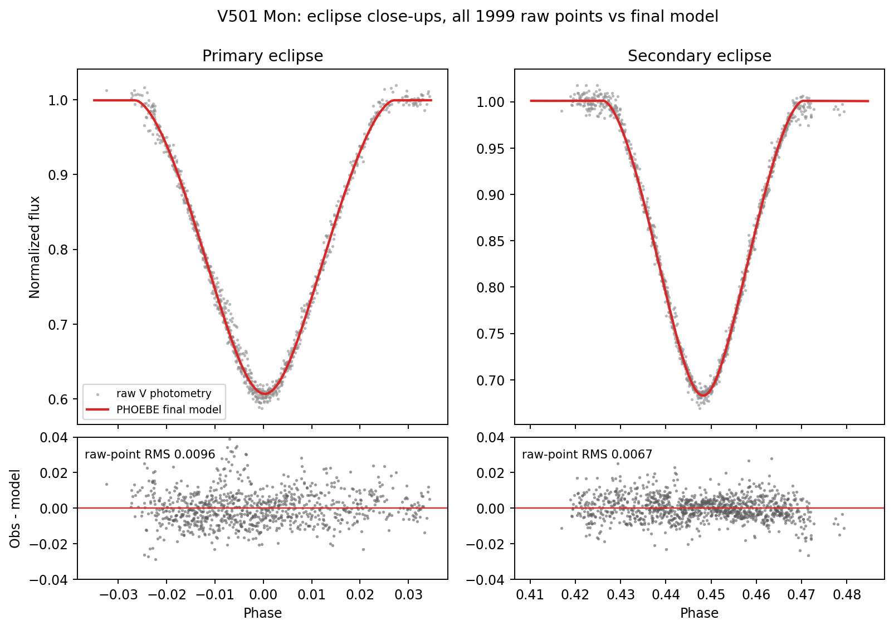
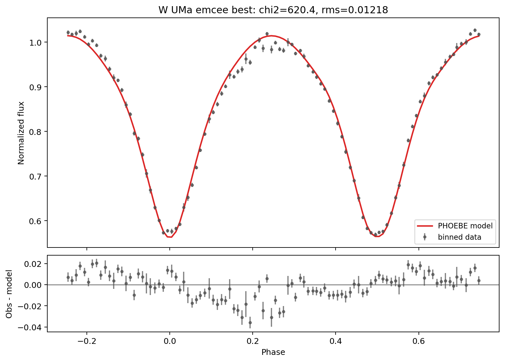
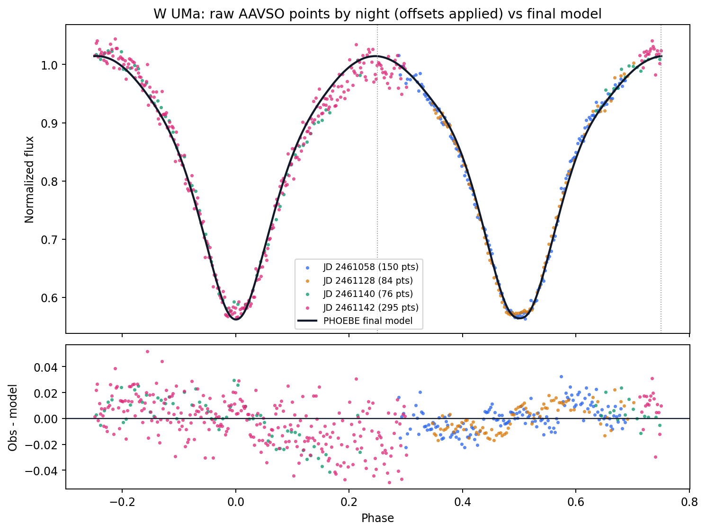
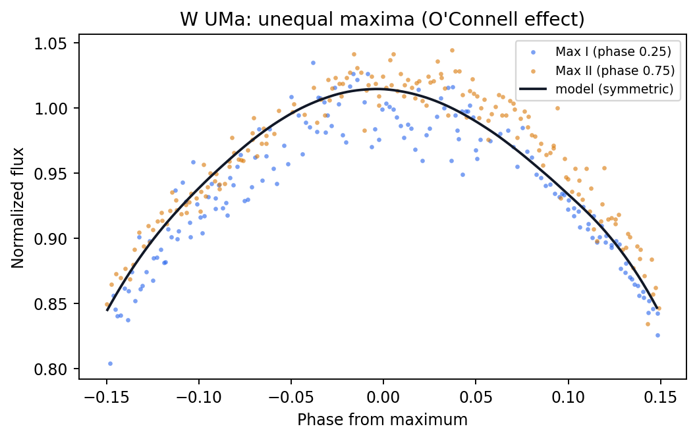

# PHOEBE Pipeline Test: V501 Mon and W UMa vs Published Solutions

Date: 2026-09-26
Input: `EcBTestData.xlsx` (two sheets: V501 Mon, W UMa)
Pipeline: the J1122 workflow (fold/bin → grid search → bounded Powell → emcee → high-resolution recompute), PHOEBE 2.4.22

## Purpose

Both targets are well-studied eclipsing binaries with published solutions, so they test whether the pipeline recovers known parameters from photometry alone. V501 Mon is a detached eccentric binary. W UMa is the prototype contact binary.

## Summary

| Target | Final χ²/dof | Agreement with literature |
|---|---:|---|
| V501 Mon | 1.28 | Every fitted parameter within published uncertainties |
| W UMa | 6.60 | Mass ratio and relative radii close; inclination and fillout off |

The pipeline reproduces the detached system to published precision. For W UMa, the misfit comes from two components that the published model includes and ours does not: third light and a cool spot.

## V501 Mon vs Torres et al. (2015)

1,999 V-band points, 1989–2024, from the Volkova & Volkov (2025) dataset. Ephemeris refined from 10 timed primary minima: P = 7.021211 d.

| Parameter | This fit | Torres et al. 2015 | Match |
|---|---|---|---|
| Inclination | 88.03 ± 0.08° | 88.022 ± 0.076° | ✓ |
| Eccentricity | 0.1346 | 0.13388 ± 0.00059 | ✓ |
| ω | 232.9° | 232.43 ± 0.21° | ✓ |
| r_A = R_A/a | 0.0849 ± 0.0011 | 0.0838 ± 0.0013 | ✓ |
| r_B = R_B/a | 0.0705 ± 0.0017 | 0.0707 ± 0.0013 | ✓ |
| T_B/T_A | 0.9295 ± 0.002 | 0.932 (7000/7510 K) | ✓ |
| Primary minimum timing | −1.3 min vs their ephemeris after 784 cycles | — | ✓ |

The residuals are flat through both eclipses (raw-point RMS 0.007–0.010), and show no drift over 35 years. That is consistent with the slow published apsidal motion rate of 0.022°/yr.

## W UMa vs Gazeas et al. (2021)

605 AAVSO points from four nights (Jan–Apr 2026), several observers, per-night zero-point offsets fitted. Ephemeris refined from four timed minima: P = 0.3336413 d.

| Parameter | This fit | Published | Match |
|---|---|---|---|
| Mass ratio q | 0.459 ± 0.010 | 0.484 ± 0.003 (spectroscopic, Pribulla et al. 2007) | ~5% low |
| Inclination | 81.8 ± 0.4° | 88.4 ± 0.8° | ✗ |
| Fillout | 0.10 ± 0.01 | 0.22 | ✗ |
| T(less massive)/T(more massive) | 1.016 | 1.045 (6450/6170 K) | same sign |
| Relative radii | ≈ 0.46 / 0.32 | 0.4532 / 0.3286 | ✓ |
| Third light (V) | 0, fixed | 0.089 ± 0.006 | not modelled |
| Cool spot | none | co-lat 15°, radius 43°, T factor 0.42 | not modelled |

## Why W UMa is off

In order of likely impact:

1. **No third light.** Gazeas et al. fit 8–11% third light (8.9% in V), mainly from the 6.4″ visual companion in ADS 7494, which is 4 mag fainter and sat inside their 20–30″ aperture. The measured third light is larger than the companion alone should give (~2.5%), which leaves room for the bound third body found from eclipse timings (Whelan et al.; Pribulla & Rucinski 2006). At 6.4″ the companion is also likely blended in most AAVSO photometry. Third light makes eclipses shallower. With it fixed at zero, the model matches the eclipse depths by lowering the inclination, and the fillout shifts with it. This is the most likely cause of the 82° vs 88° difference.

2. **No starspot.** Max I (phase 0.25) is about 2–3% fainter than Max II (the O'Connell effect). A symmetric model cannot fit this, which leaves a residual wave across the whole orbit. Gazeas et al. and Linnell (1991) model it with cool spots on the more massive star. Because χ² is minimized globally, fitting that asymmetry without a spot also pulls on q, the inclination and the fillout.

3. **Photometric q is only weakly constrained.** Without total eclipses, q is correlated with inclination and fillout. Our photometric q (0.459) is 5% below the spectroscopic value. A fit that fixes q = 0.484 would remove one degree of freedom.

4. **Data limitations.**
   - Only four nights, from different observers, and the filter is unknown (V assumed).
   - Per-point scatter is 0.01–0.02 mag.
   - Almost all of phases −0.25 to 0.3, including all of Max I, comes from a single night (JD 2461142). Within that night the residuals swing from +0.02 to −0.04. That rules out the night offsets as the cause, but it could be the spot or an airmass/extinction trend, and one night cannot separate the two.

5. **Different epoch.** The published photometry is from 2001; ours is from 2026. Spot configurations in contact binaries change over years, and W UMa's period has changed. Our timings are 93 min off the 2001 ephemeris (P = 0.3336352 d then vs 0.3336413 d now). Some parameter differences may be real changes in the star.

6. **Simplified physics.** The pipeline uses blackbody atmospheres, a fixed linear limb-darkening coefficient, and a fixed primary temperature (6450 K) and scale (a = 2.4 R☉). These matter less for V501 Mon (which still matched), but a contact binary's continuous light curve is more sensitive to limb and gravity darkening.

## Suggested next run for W UMa

- Fix third light at 0.089, or give it a prior from about 0.025 to 0.11.
- Add one cool spot on the more massive star (starting from the Gazeas position).
- Optionally fix q = 0.484 from spectroscopy.
- Refit. The inclination should move toward 88° and the residual wave should shrink.

## Caveats

- The emcee chains are short (16 walkers × 60 steps, ~10 autocorrelation times), so the quoted uncertainties are indicative.
- The uncertainties were rescaled so the best fit has χ²/dof = 1.
- For V501 Mon, T_A = 7500 K, q = 0.89 and a = 22.5 R☉ were fixed inputs. They happen to be close to the published values.

## References

- Torres, G. et al. 2015, AJ 150, 154 — [arXiv:1509.07873](https://arxiv.org/abs/1509.07873)
- Volkova, I. & Volkov, I. 2025, Astron. Rep. 69, 480 — [link](https://link.springer.com/article/10.1134/S1063772925701859)
- Gazeas, K. et al. 2021, MNRAS 501, 2897 — [arXiv:2101.10680](https://arxiv.org/abs/2101.10680)
- Pribulla, T. et al. 2007; Pribulla & Rucinski 2006; Whelan et al. 1973; Linnell 1991; Mason et al. 2001 — as cited in Gazeas et al. 2021
