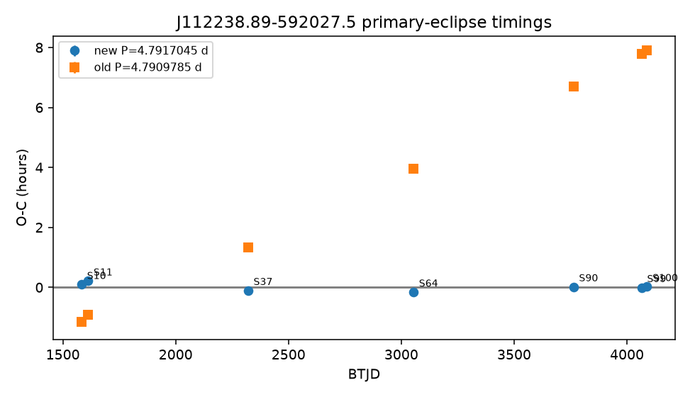
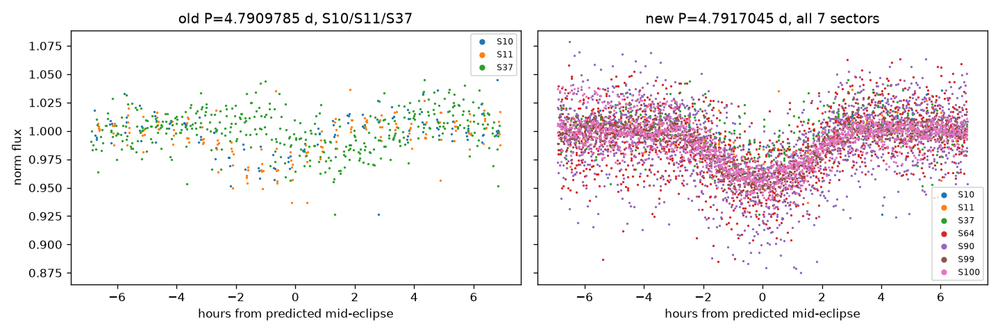
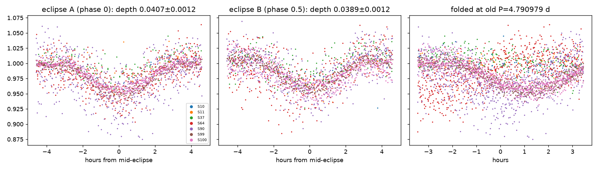
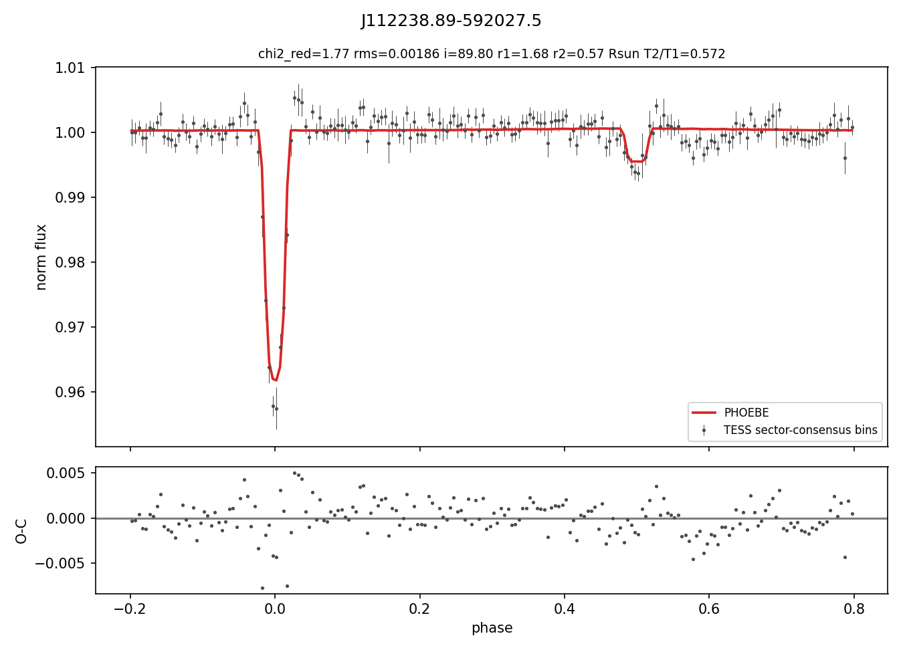

# J1122 Ephemeris Correction and 7-Sector Remodel

Date: 2026-10-02
Target: `J112238.89-592027.5` (TIC 451126962)

## Summary

The period used in all earlier J1122 work, **P = 4.790978516 d**, came from a coarse BLS search on sectors 10, 11 and 37. It is wrong by 7.3×10⁻⁴ d per cycle. Eclipse timings from all seven TESS sectors (10, 11, 37, 64, 90, 99, 100; QLP light curves) give

| | P (d) | T0 (BTJD) |
|---|---|---|
| old (BLS, 3 sectors) | 4.790978516 | 1573.0869 |
| **new (O−C, 7 sectors)** | **4.7917045 ± 0.0000058** | **3762.8427 ± 0.0006** |

The old period is ~126σ away from the timing solution.

## Why this matters for the earlier PHOEBE work

On the old ephemeris, the primary eclipse in the three sectors used before falls at

| Sector | O−C vs old ephemeris |
|---|---:|
| S10 | −1.15 h |
| S11 | −0.92 h |
| S37 | +1.34 h |

The eclipse is only ~5–6 h long, so a 2.5 h spread between sectors smears the folded eclipse. The smear also depends on sector, because each sector's eclipses are shifted by a different amount. That matches what `J1122_SECTOR_ISOLATED_MODELING.md` found:

- the eclipse residual bias depended on sector;
- dropping a sector or fitting sectors as separate datasets made the fit worse;
- requiring all three sectors in each phase bin reduced the bias (it averages the shifted eclipses);
- PHOEBE parameter refinement could not remove the remaining bias.

The "remaining structure" in that document is most likely ephemeris smearing, not sparse TESS sampling.

## Is the period 4.79 d or 9.58 d?

Folding at 2P gives two eclipses of almost equal depth, so the odd and even primaries were measured separately:

- odd/even primary depth: 0.0294 vs 0.0298, a 0.1σ difference using eclipse-to-eclipse scatter (0.0407 vs 0.0389 ± 0.0012 from a direct core measurement);
- a shallow secondary is present at phase 0.5 of the 4.79 d fold, with depth ≈ 0.11 × primary (0.0067 vs 0.043 in the binned curve).

So **P = 4.7917 d** is the period. 2P would require identical eclipses with no secondary.

## TESS contamination (third light)

TIC v8.2 gives J1122 a contamination ratio of **0.58**, meaning about 37% of the flux in the TESS aperture is from other stars. The earlier PHOEBE models fixed l3 = 0 and used T_eff,1 = 6000 K. The TIC value is **7705 K**. Both affect the inclination and radii, so the remodel below fits l3 and uses the TIC T_eff.

## 7-sector remodel

Input: `outputs/candidates/J112238.89-592027.5/J112238.89-592027.5_binned.txt`. This is a sector-consensus, phase-binned curve from all 7 sectors on the new ephemeris, with outlier filtering.

Pipeline: `src/pipeline/run_phoebe_candidate.py --teff 7705 --fit-l3 --l3 0.37 --tag _7sector` (grid → Nelder–Mead → emcee → high-resolution recompute).

**Result (2026-10-02):**

| Parameter | Value |
|---|---|
| Inclination | 89.80° |
| r₁ / r₂ (R/a) | 0.0986 / 0.0331 |
| T2/T1 | 0.572 (T2 ≈ 4410 K) |
| Third light, fitted | **0.16** (TIC contamination predicts ~0.37) |
| χ²_red | **1.77** |
| RMS | 1.86 ppt |
| Eclipse bias (primary / secondary) | -3.2σ / -0.8σ |

This is a good light-curve fit on the corrected ephemeris. The primary bias is only borderline (|bias| < 3σ is the pass threshold). The binary-blackbody check fails:
- the photosphere fit to J, H, Ks, W1 gives χ² = 116;
- d_phot / d_Gaia = 0.51, i.e. J1122 is ~3.8× more luminous than an MS binary at 7705 K with this geometry;
- the W3/W4 excess survives the binary photosphere at 32σ / 13σ.

Bundle: `outputs/candidates/J112238.89-592027.5/J112238.89-592027.5_phoebe_best_7sector.phoebe`

## Recommended next steps for J1122

1. Re-run the earlier custom-aperture extraction (`src/extract_multisector_tess_lightcurve.py`) on all seven sectors with `--period 4.7917045 --t0 3762.8427`. Then compare with the QLP curve, especially eclipse depth, since aperture dilution differs between the two.
2. Use the new ephemeris for any further emcee runs. The binned inputs under `outputs/j1122_*` were all folded on the old period and should not be reused.
3. Check whether the secondary-eclipse depth stays consistent with the l3-corrected model. If it does, the WISE excess interpretation (`J1122_PRELIMINARY_RESULTS.md`) is unchanged, because it depends on the SED and not on the period.
